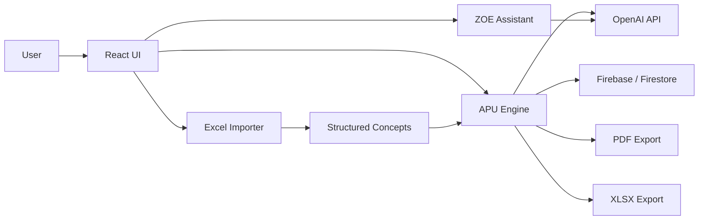

# ZOEMEC AI

**AI Operating System for Construction Cost Intelligence**

ZOEMEC AI transforms construction concepts, Excel catalogs and technical documents into traceable Unit Price Analyses, editable budgets, and professional PDF and Excel deliverables using OpenAI models and Codex-assisted engineering workflows.

<p align="center">
  
</p>

<p align="center">
  <a href="https://zoemec-plataforma-ia.vercel.app">Live demo</a> ·
  <a href="https://openai.com/build-week/">OpenAI Build Week</a>
</p>


## Problem

Construction cost engineers still spend too much time working across disconnected files and manual reviews:

- scattered Excel catalogs;
- inconsistent APU matrices;
- manual concept classification;
- technical sources without traceability;
- slow budget preparation and document delivery.

This creates risk: wrong units, incompatible materials, reused matrices without context, and PDF/Excel outputs that are hard to audit.

## Solution

ZOEMEC AI is designed as a technical cost-intelligence workspace. It helps engineers:

- interpret construction concepts;
- classify specialties and work families;
- generate Unit Price Analyses;
- validate materials, labor, equipment and indirect costs;
- detect incoherences and low-confidence assumptions;
- preserve evidence by file, sheet and row;
- assemble editable budgets;
- export professional PDF and XLSX deliverables.

## Core Workflow

```text
Document
→ Concept extraction
→ Classification
→ Evidence retrieval
→ APU generation
→ Technical validation
→ Budget
→ PDF / Excel
```

## Key Features

- Natural language APU generation.
- Excel import for technical catalogs.
- Multi-sheet concept extraction.
- Technical APU editor.
- Cost breakdown for materials, labor, equipment, FSR, indirect costs, financing and utility.
- Evidence and traceability fields.
- ZOE contextual assistant.
- PDF export.
- XLSX export.
- Firebase Authentication.
- Firestore-backed user and access data.
- Project and budget management.

## OpenAI And GPT-5.6 Usage

The OpenAI integration is implemented through secure server-side endpoints and local development server support. The active model is configured with environment variables such as `OPENAI_MODEL`, `OPENAI_PRICE_MODEL` and `OPENAI_VISUAL_MODEL`.

For Build Week, ZOEMEC is structured so GPT-5.6 can be used by setting `OPENAI_MODEL` to the authorized model name in the deployment environment. The current default in `.env.example` is `gpt-4.1-mini`; the repository does not hard-code GPT-5.6 as the only runtime model.

When configured, OpenAI models are used to:

- interpret technical construction descriptions;
- extract object type, specialty, unit, dimensions, standards, scope and constraints;
- propose structured APU components;
- identify incompatible materials, labor and equipment;
- generate explanations and validation notes;
- support contextual technical assistance through ZOE.

## How Codex Was Used

Codex assisted the project during OpenAI Build Week through:

- architecture review;
- React component implementation;
- bug fixing;
- import pipeline hardening;
- APU validation rules;
- PDF and Excel export improvements;
- test generation;
- route cleanup;
- UI refactoring;
- Vercel deployment support.

Codex was used as an engineering partner: reviewing implementation risks, improving UX flows, validating behavior, and preparing production-ready documentation.

## Architecture



See [docs/ARCHITECTURE.md](docs/ARCHITECTURE.md) for more detail.

## Technology Stack

- React
- JavaScript
- Vite
- Firebase Authentication
- Firestore
- Firebase Storage
- Vercel
- OpenAI API
- Codex
- `read-excel-file` and `write-excel-file`
- `jsPDF`
- GitHub

## Screenshots

Screenshot placeholders are prepared in `docs/images/`. Add final PNG captures before a public judging submission.

| Screen | Path | Status |
| --- | --- | --- |
| Landing | `docs/images/landing.png` | Placeholder pending |
| Login | `docs/images/login.png` | Placeholder pending |
| Dashboard / Operating center | `docs/images/dashboard.png` | Placeholder pending |
| APU generator | `docs/images/apu-generator.png` | Placeholder pending |
| APU editor | `docs/images/apu-editor.png` | Placeholder pending |
| Excel import | `docs/images/excel-import.png` | Placeholder pending |
| ZOE assistant | `docs/images/zoe-assistant.png` | Placeholder pending |

## Live Demo

Demo URL:

https://zoemec-plataforma-ia.vercel.app

Test instructions:

1. Open the demo URL.
2. Use Google authentication or create a new account.
3. Go to **Generar APU**.
4. Enter a real construction concept.
5. Generate and review the APU.
6. Add it to a budget.
7. Export PDF and Excel deliverables.

No personal credentials are published in this repository.

## Local Setup

```bash
git clone https://github.com/dyann1984/Zoemec-Plataforma-IA.git
cd Zoemec-Plataforma-IA
npm install
npm run dev
```

Local development usually opens at:

```text
http://127.0.0.1:5173
```

Build locally:

```bash
npm run build
```

Preview production build:

```bash
npm run preview
```

Deploy with Vercel after configuring environment variables:

```bash
npx vercel --prod
```

## Environment Variables

Do not commit `.env` files or service-account JSON. Use `.env.example` as a template.

| Variable | Used by | Required | Notes |
| --- | --- | --- | --- |
| `OPENAI_API_KEY` | API/server | Yes for AI | Server-side only. Never expose in React code. |
| `OPENAI_MODEL` | API/server | Optional | Default model for APU generation. |
| `OPENAI_PRICE_MODEL` | API | Optional | Market price assistance. |
| `OPENAI_VISUAL_MODEL` | API | Optional | Visual brief generation. |
| `OPENAI_IMAGE_MODEL` | API | Optional | Image generation endpoint. |
| `OPENAI_IMAGE_SIZE` | API | Optional | Image output size. |
| `ZOEMEC_AI_PORT` | local server | Optional | Local OpenAI helper server port. |
| `VITE_FIREBASE_API_KEY` | React | Optional | Firebase Web SDK public config. |
| `VITE_FIREBASE_AUTH_DOMAIN` | React | Optional | Firebase Web SDK public config. |
| `VITE_FIREBASE_PROJECT_ID` | React | Optional | Firebase Web SDK public config. |
| `VITE_FIREBASE_STORAGE_BUCKET` | React | Optional | Firebase Web SDK public config. |
| `VITE_FIREBASE_MESSAGING_SENDER_ID` | React | Optional | Firebase Web SDK public config. |
| `VITE_FIREBASE_APP_ID` | React | Optional | Firebase Web SDK public config. |
| `VITE_FIREBASE_MEASUREMENT_ID` | React | Optional | Firebase analytics ID if used. |
| `FIREBASE_SERVICE_ACCOUNT_JSON` | API | Required for protected server actions | Server-side only. |
| `FIREBASE_PROJECT_ID` | API | Optional | Used with separate Firebase Admin fields. |
| `FIREBASE_CLIENT_EMAIL` | API | Optional | Server-side only. |
| `FIREBASE_PRIVATE_KEY` | API | Optional | Server-side only. |
| `MP_ACCESS_TOKEN` | API | In progress | Payment integration. |
| `MP_WEBHOOK_URL` | API | In progress | Payment webhook. |
| `PUBLIC_APP_URL` | API | Optional | Public deployment URL. |
| `VITE_CONTEST_MODE` | React | Optional | Build Week focused UI mode. |

## Current Status

Working:

- Authentication.
- APU generation.
- APU editing.
- PDF export.
- Excel export.
- Project navigation.
- Budget management.

In progress:

- OneDrive / Microsoft Graph integration.
- Advanced voice mode.
- Semantic library indexing.
- Payment integrations.
- Production-grade audit trail.

## Demo Scenario

A 2-3 minute demo can be presented as:

1. Sign in.
2. Enter a construction concept.
3. Generate an APU.
4. Review materials, labor and equipment.
5. Ask ZOE to explain the matrix.
6. Edit a value.
7. Add the APU to a budget.
8. Export PDF and Excel.

## Challenges

- Technical classification must understand construction language, not only keywords.
- APU matrices must avoid incompatible materials, labor and equipment.
- Multi-sheet Excel parsing needs reliable structure detection.
- Cost intelligence requires traceability back to source files.
- Engineers need explainability before approving AI-assisted output.
- PDF and XLSX exports must be professional and auditable.

## What We Learned

- AI for engineering needs structured validation.
- Domain rules matter more than generic text generation.
- Evidence is critical for trust.
- AI must support engineers, not replace them.

## Roadmap

- OneDrive / Microsoft Graph source connection.
- Semantic technical library indexing.
- BIM integration.
- Regional price databases.
- Multi-company support.
- Voice engineering assistant.
- Collaboration workflows.
- Audit trail and approval history.

## Español

ZOEMEC AI busca convertir documentos, catálogos Excel y conceptos de obra en APUs trazables, presupuestos editables y entregables profesionales para ingeniería de costos.

## License

No open-source license is currently provided.

All rights reserved.
