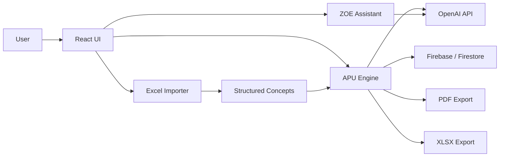

# ZOEMEC AI Architecture

ZOEMEC AI is a React and Vite application deployed on Vercel with Firebase services and server-side API endpoints for protected AI and payment operations.

## Runtime View

## Main Parts

| Area | Files | Responsibility |
| --- | --- | --- |
| React UI | `src/main.jsx`, `src/style.css` | Main product shell, modules, APU UI, budgets and library views. |
| Firebase client | `src/firebase.js`, `src/cloud.js` | Authentication, Firestore and Storage client access. |
| AI endpoints | `api/generate-apu.mjs`, `api/assistant.mjs`, `api/market-price.mjs`, `api/visual-ai.mjs` | Server-side OpenAI calls. |
| AI core | `api/_openaiApuCore.mjs`, `server/openai-apu-server.mjs` | Prompting and local/server APU generation support. |
| Auth guard | `api/_authGuard.mjs`, `api/_firebaseAdmin.mjs` | Firebase Admin validation for protected API routes. |
| Exports | `src/main.jsx` | PDF generation with `jsPDF` and Excel export with `write-excel-file`. |
| Excel import | `src/main.jsx` | Catalog and concept parsing with `read-excel-file`. |

## Data Flow

1. The user enters a concept or imports an Excel file.
2. The UI extracts concept data and keeps editable state in React/local storage/cloud state.
3. The APU engine creates materials, labor, equipment and indirect-cost structures.
4. Optional server-side OpenAI endpoints enrich or validate the technical output.
5. Firebase Authentication controls user access.
6. Firestore and Storage support user data and uploaded files.
7. PDF and XLSX deliverables are generated in the browser.

## Security Boundaries

- `OPENAI_API_KEY` is used only in server-side endpoints.
- Firebase Admin credentials must stay in Vercel environment variables.
- `.env`, service-account files, `node_modules`, `dist` and private samples must not be committed.
- Firebase Web SDK variables are public configuration, not admin secrets.

## Known Technical Debt

- `src/main.jsx` is still very large and should be progressively split into `components`, `pages`, `services`, `hooks` and `utils`.
- Advanced semantic indexing is not production-complete.
- Payment flows are present as API scaffolding but remain in progress.
- OneDrive/Microsoft Graph integration is documented as roadmap/in progress.
