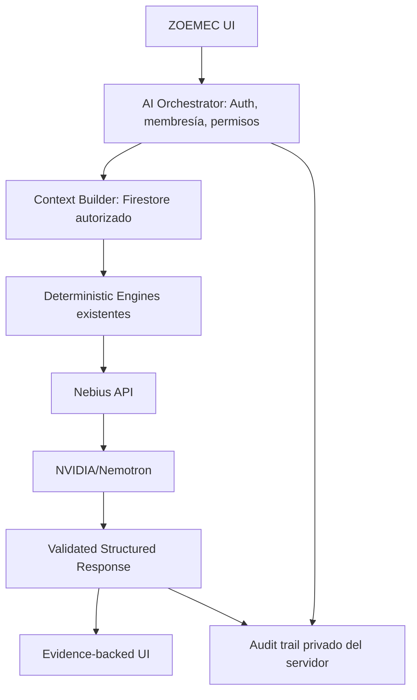

# Nebius × NVIDIA Global AI Hackathon — ZOEMEC

Estado de entrega: integración implementada y pruebas locales verificadas; **NO terminada para los criterios de llamada real**. No existe `NEBIUS_API_KEY` en los archivos revisados ni en el proceso. No se ha llamado a Nebius, no se ha consumido crédito y no se ha desplegado a producción.

## Antes del hackathon

ZOEMEC ya incluía React/Vite, Firebase Auth/Firestore/Storage, API Node, generación de APU con OpenAI, cálculos APU, auditoría, Challenge, Confidence, Bid Risk, Scenario Engine, Memoria Técnica, biblioteca, evidencia, Visual IA, levantamientos, CAD 2D/3D, cuantificación y reportes PDF/XLSX. No se atribuyen estos motores a esta entrega.

Ver [baseline](NEBIUS_BASELINE.md): suite previa de 1977 pruebas y build correctos. Existían numerosos cambios locales sin commit; se conservaron. No hay scripts de lint ni typecheck. La documentación histórica `ARCHITECTURE.md` contiene algunas rutas anteriores a la consolidación del gateway; el código real usa `server/api-lib`.

## Construido en esta entrega

- Proveedor desacoplado con seis métodos: contexto de proyecto, riesgo, Confidence, APU, acciones y preguntas.
- Endpoint `/api/engineering-ai` compartido por servidor local y gateway Vercel.
- Lectura autorizada de proyecto/APUs guardados, memoria PROJECT y metadatos de evidencia.
- Ejecución de motores determinísticos existentes antes de contactar al proveedor.
- Contexto minimizado y referencias de evidencia con valores inmutables del servidor.
- JSON Schema y validación adicional; FACT separado de INFERENCE y RECOMMENDATION.
- Panel ZOEMEC AI en Intelligence/APU y workspace del proyecto, sin cambiar navegación principal.
- Resumen de proyecto con indicadores por APU; simulación porcentual mediante Scenario Engine.
- Auditoría de IA y panel administrativo con métricas observadas.
- Fixture y seed de demo sintética aislada en emuladores, pruebas y comprobación manual real preparada.

## Arquitectura y datos



El cliente solo envía IDs, tipo de análisis, pregunta y parámetros opcionales de escenario. No puede enviar tenant, indicadores ni contexto arbitrario. La identidad proviene de Firebase Auth. Un documento empresarial exige organización coincidente y membresía activa, incluso si el solicitante es dueño original o superadmin. Un documento individual exige el dueño autenticado. Un APU además debe pertenecer al proyecto autorizado.

El servidor reutiliza `computeZoemecIntelligence`, `calcAPUv2`, `buildMemoryEvidence` y `runScenarioLab`. No escribe APUs ni recalcula cifras con el LLM. La UI muestra versión guardada y advierte que no incluye ediciones locales. Las exposiciones estimadas se presentan por APU: no se suman como si fueran un presupuesto ni se convierte un valor no calculable en cero.

Se excluyen correos, identidad de autores, rutas Storage, enlaces firmados, documentos completos y archivos. Solo se incluyen campos técnicos de recursos/fuentes y metadatos de evidencia. Los textos libres se limitan y se redactan patrones de correo, URL y secretos. Esto no constituye un detector universal de PII: revisar el contenido técnico antes de usar datos privados.

## Proveedor real preparado

Modelo configurado por defecto: `nvidia/nemotron-3-super-120b-a12b`.

Transporte: `POST https://api.tokenfactory.nebius.com/v1/chat/completions`, Bearer API key, mensajes system/user, `max_tokens`, `response_format: json_schema`. También se admite el endpoint regional oficial `https://api.tokenfactory.us-central1.nebius.com/v1`. Se rechazan otros hosts y redirecciones para evitar enviar la clave a un destino arbitrario.

Fuentes oficiales consultadas el 2026-09-29:
- [Modelo y ejemplo Nebius/NVIDIA](https://nebius.com/services/token-factory/nemotron).
- [Structured output](https://docs.tokenfactory.nebius.com/ai-models-inference/json).
- [Referencia API](https://api.tokenfactory.nebius.com/docs).
- [Reglas del hackathon](https://nebiusglobalaihackathon.devpost.com/rules).

La documentación permite seleccionar Nemotron y solicitar JSON Schema. **La disponibilidad para esta cuenta, compatibilidad exacta del modelo/esquema y latencia real siguen sin comprobarse.** Un rechazo del proveedor no activa una respuesta simulada ni un fallback silencioso a OpenAI.

## Configuración

Con Node 22 y dependencias existentes:

```sh
npm ci
```

Agregar al entorno del servidor o a `.env.local` (nunca commitear):

```dotenv
NEBIUS_API_KEY=<clave del servidor>
NEBIUS_BASE_URL=https://api.tokenfactory.nebius.com/v1
NEBIUS_MODEL=nvidia/nemotron-3-super-120b-a12b
```

Ninguna variable secreta lleva prefijo `VITE_`. El frontend consulta solo estado y modelo. Sin clave muestra **Nebius no configurado**; el endpoint devuelve código específico sin simular explicación.

La autenticación real requiere la configuración Firebase Admin ya utilizada por ZOEMEC. En local, `npm run ai` carga `.env` y `.env.local`; `npm run dev` sirve el cliente con proxy al backend.

Comprobación manual que consume una llamada, solo con datos DEMO:

```sh
node --env-file=.env.local scripts/nebius-smoke.mjs
```

También `npm run nebius:smoke` si las variables ya están en el proceso. Solo tras una respuesta real validada se crea `docs/NEBIUS_REAL_CALL.json` con fecha, modelo, ID del proveedor, tokens observados y latencia. Ese archivo **no existe como prueba de éxito en esta entrega**. No se guardan claves, prompts ni respuestas completas en la evidencia de llamada.

## Demo reproducible y aislada (PowerShell)

Nombre: **Residencial Las Palmas - Edificio A**. Empresa DEMO separada, usuario local y APU de acero con fuentes sintéticas incompletas para activar hallazgos reales de los motores. Nunca se etiquetan como precios de mercado verificados. Los indicadores se recalculan con los motores, no son respuestas IA pregrabadas.

La exportación local ya se generó en `.tmp/nebius-demo-data`. Para regenerarla:

```powershell
npx firebase emulators:exec --project demo-zoemec-nebius --only firestore,auth --export-on-exit .tmp/nebius-demo-data "node scripts/seed-nebius-demo.mjs"
```

Terminal 1:

```powershell
npx firebase emulators:start --project demo-zoemec-nebius --only firestore,auth --import .tmp/nebius-demo-data
```

Terminal 2:

```powershell
$env:FIRESTORE_EMULATOR_HOST='127.0.0.1:8080'
$env:FIREBASE_AUTH_EMULATOR_HOST='127.0.0.1:9099'
$env:FIREBASE_PROJECT_ID='demo-zoemec-nebius'
npm run ai
```

Terminal 3:

```powershell
$env:VITE_FIREBASE_PROJECT_ID='demo-zoemec-nebius'
$env:VITE_USE_FIREBASE_EMULATOR='true'
npm run dev
```

Abrir la URL local indicada por Vite. Usuario: `ingeniero@nebius-demo.test`; contraseña **solo del emulador**: `DemoLocal-2026!`.

1. Iniciar sesión → Proyectos y clientes → abrir Residencial Las Palmas - Edificio A.
2. Abrir el APU guardado de acero. Mostrar Confidence, Bid Risk y auditoría existentes.
3. Abrir **ZOEMEC AI · Explicar este APU con evidencia** y pulsar Explicar Confidence.
4. Expandir evidencia y comparar valores con las pestañas de Intelligence.
5. Preguntar qué corregir y mostrar acciones separadas de hechos.
6. En escenario, habilitar cálculo, escribir descripción exacta `Acero de refuerzo`, cambio `8` y consultar el impacto. El Scenario Engine calcula y el LLM explica sin guardar cambios.
7. En el workspace abrir **Analizar proyecto con IA** para el resumen de todos los APUs guardados.
8. Panel Admin → IA y consumo → Nebius muestra únicamente datos registrados, con acceso superadmin. El usuario demo es responsable de empresa, no superadmin.

Sin clave, los pasos de explicación deben detenerse en el estado explícito de falta de configuración. El seed se niega a ejecutar sin ambos emuladores locales y no sobrescribe documentos existentes.

## Seguridad y límites

- Autenticación/plan existentes, membresía activa, aislamiento de tenant/proyecto antes del contexto y de la llamada.
- Límite atómico existente de assistant: 40 solicitudes/hora por usuario, también superadmin; no reemplaza límites del proveedor.
- Pregunta de hasta 1000 caracteres, solicitud hasta 5000, máximo 20 APUs, 100 metadatos y 100 memorias; contexto máximo 130000 caracteres. Se devuelve error explícito, no resumen parcial silencioso.
- Timeout del proveedor de 45 segundos, sin reintentos automáticos que multipliquen consumo.
- Prompt trata descripción, pregunta y evidencia como datos no confiables. No hay herramientas ejecutables ni modificaciones automáticas del proyecto.
- FACT consiste en referencias a valores del servidor; no se acepta texto factual redactado por el modelo.
- Textos generados sin dígitos, enlaces, HTML ni patrones de normas; referencias válidas obligatorias. Los valores numéricos se muestran en evidencia/indicadores determinísticos.
- React escapa el texto; no hay `dangerouslySetInnerHTML`, Markdown ejecutable ni links del modelo.
- Validación estructural y de referencias **no prueba corrección semántica completa**. Pueden existir inferencias equivocadas, incluso sin cifras. Revisión humana necesaria.
- Audit trail: timestamp, tenant/usuario, IDs, versiones, hash del contexto, tipo, proveedor/modelo, referencias, request ID, tokens observados, latencia, éxito/error. Nunca prompts ni API keys.
- La colección `engineeringAiAudit` queda excluida del catch-all administrativo de Firestore. Lectura de métricas solo por API superadmin; escrituras solo Admin SDK.
- Las llamadas Nebius no se suman a estimaciones de costo OpenAI. No hay facturación Nebius conectada; costo se muestra no disponible.
- Se reportan hasta los últimos 100 análisis; no son totales históricos ni facturación. Errores anteriores a la autorización no registran contexto de un tenant ajeno.
- Los escenarios son porcentuales explícitos. No hay parser general de lenguaje natural ni ejecución automática de acciones.
- Memoria limitada al proyecto para mantener paridad con el panel actual. No se recuperan documentos semánticamente ni se interpreta contenido multimedia.
- No se ha desplegado ni validado en producción.

## Pruebas y resultados

| Validación | Resultado comprobado |
|---|---|
| Baseline `npm test` | 1977 PASS, 0 fallos |
| Regresión posterior `npm test` | 1977 PASS, 0 fallos |
| `npm run test:nebius` | 15 PASS, proveedor mock |
| `npm run test:nebius-api` | 10 PASS, Firebase Auth/Firestore emulados |
| Regresión reglas generales, organizaciones, gateway y nuevas pruebas | 145 PASS, emuladores; `FIREBASE_PROJECT_ID=demo-zoemec-nebius` explícito |
| `npm run test:nebius-ui` | PASS, Edge headless; 1440/390/320 px; proveedor mock |
| Aplicación completa: login → proyecto DEMO → workspace → estado autenticado | PASS, backend local real y emuladores; sin llamada al proveedor |
| Build previo y posterior | PASS; advertencias preexistentes de importaciones |
| Lint | No configurado; no se declara PASS |
| Typecheck | No configurado (JavaScript); no se declara PASS |
| Llamada real NVIDIA/Nebius | PENDIENTE: falta clave |

UI comprobó configuración ausente, acciones sugeridas, pregunta libre, escenario, referencias expandibles, errores recuperables, evidencia insuficiente, carga y descarte de respuesta tardía al cambiar proyecto. Sin errores JS ni desbordamiento horizontal en el panel probado. Capturas y logs en `.tmp/nebius-ui` y `.tmp/nebius-*.log` (locales, no versionados).

La verificación integrada detectó y corrigió que el adaptador HTTP local carecía de `setHeader`. Un primer intento de regresión combinada falló por mezclar el ID predeterminado de los tests antiguos con el proyecto demo; al establecer explícitamente `FIREBASE_PROJECT_ID`, las 145 pruebas pasaron. No se cambió el comportamiento de los tests antiguos para forzar su aprobación.

La prueba UI requiere Playwright disponible y Edge o Chrome instalado. Puede usarse `ZOEMEC_PLAYWRIGHT_MODULE` con ruta al `index.mjs` de Playwright del runtime y `ZOEMEC_BROWSER_CHANNEL=msedge` (predeterminado). No se agregó una dependencia de producción para las pruebas.

## Archivos de esta entrega

Nuevos: `server/api-lib/_engineeringContext.mjs`, `_engineeringOrchestrator.mjs`, `_nebiusProvider.mjs`, `_route-engineering-ai.mjs`; `src/features/apu/EngineeringCopilot.jsx`, `engineeringCopilot.css`; `src/features/admin/NebiusAdminStatus.jsx`; `src/domain/nebiusDemo.js`; `scripts/seed-nebius-demo.mjs`, `nebius-smoke.mjs`; `test/nebiusEngineering.test.mjs`, `nebiusApi.test.mjs`, `nebiusRules.test.mjs`, `nebiusUi.mjs`, `nebiusDemoUi.mjs`, `test/qa/nebius/index.html`, `main.jsx`; este documento y `NEBIUS_BASELINE.md`.

Modificados puntualmente: `api/gateway.mjs`, `server/openai-apu-server.mjs`, `vercel.json`, `firestore.rules`, `package.json`, `.env.example`, `README.md`, `src/features/apu/ZoemecIntelligencePanel.jsx`, `src/features/projects/workspace/ProjectWorkspace.jsx`, `src/features/admin/AdminPanel.jsx`. Ningún motor determinístico fue reemplazado.

## Capturas para Devpost y pendientes de cierre

Grabar el proyecto DEMO → APU → Confidence/Bid Risk/auditoría → consulta REAL → modelo e ID visibles → evidencia expandida → recomendación → escenario calculado. Mencionar en audio NVIDIA/Nemotron y Nebius Token Factory. Mostrar una captura móvil, el diagrama y las pruebas; distinguir claramente motores previos y nueva capa explicativa.

Antes de declarar entrega completa: configurar clave del servidor, ejecutar smoke real, comprobar aceptación del esquema/modelo, validar semántica de respuestas con varios APUs, grabar la demo real y verificar el despliegue de prueba. No usar capturas de mocks como evidencia de integración real. No se puede marcar el checklist completo mientras esos puntos sigan pendientes.
