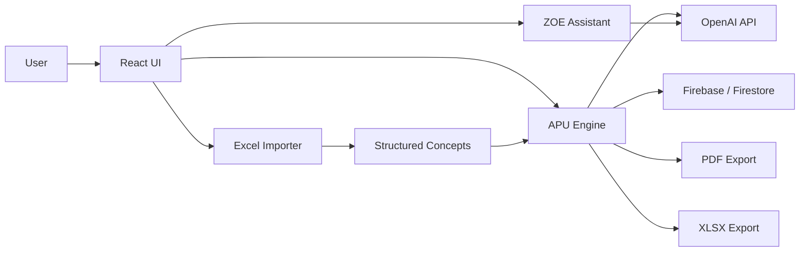

# OpenAI Build Week Submission

## Project Summary

ZOEMEC AI is an AI operating system for construction cost intelligence. It helps transform construction concepts, Excel catalogs and technical documents into traceable Unit Price Analyses, editable budgets, and professional PDF/XLSX deliverables.

## Problem

Cost engineers often prepare budgets through disconnected Excel files, inconsistent matrices and manual review. This slows down cost estimation and makes it hard to verify where each assumption came from.

## Solution

ZOEMEC provides a workflow where technical documents become concepts, concepts become classified APUs, and APUs become validated budgets and deliverables. The system keeps the engineer in control while AI assists with interpretation, classification, validation and explanation.

## OpenAI Usage

OpenAI models are called from server-side endpoints, never directly from exposed browser secrets. They support:

- APU generation from natural language concepts;
- technical explanation through ZOE;
- price and market context assistance;
- visual brief generation for construction-related workflows.

## GPT-5.6 Usage

The model is environment-configurable through `OPENAI_MODEL`. ZOEMEC is prepared to use GPT-5.6 when the deployment environment is authorized for that model. The current repository default remains `gpt-4.1-mini`, so the project does not falsely hard-code GPT-5.6 as the only active model.

Target GPT-5.6 responsibilities:

- interpret construction descriptions;
- extract object type, specialty, unit, dimensions, standards, scope and constraints;
- propose structured APU components;
- identify incompatible materials, labor and equipment;
- generate validation notes and explanations;
- power contextual assistance through ZOE.

## Codex Usage

Codex supported the Build Week process as an engineering collaborator:

- architecture review;
- React implementation;
- route cleanup;
- import pipeline fixes;
- APU validation rules;
- PDF and Excel export support;
- UI refactoring;
- test and build validation;
- Vercel deployment support;
- repository documentation.

## Demo Steps

1. Sign in.
2. Enter a construction concept.
3. Generate an APU.
4. Review materials, labor and equipment.
5. Ask ZOE to explain the matrix.
6. Edit a value.
7. Add to budget.
8. Export PDF and Excel.

## Technical Architecture

## Limitations

- OneDrive/Microsoft Graph integration is still in progress.
- Semantic library indexing is not fully productionized.
- Advanced voice mode depends on browser support and permissions.
- Payment integrations are present as scaffolding/in progress.
- The current `main` branch still contains a large `src/main.jsx` file that should be decomposed in future architecture work.

## Next Steps

- Complete semantic technical-library indexing.
- Add Microsoft Graph / OneDrive ingestion.
- Add regional cost databases.
- Improve approval audit trail.
- Add multi-company collaboration.
- Expand ZOE voice interaction.
- Connect BIM quantities and cost intelligence.
